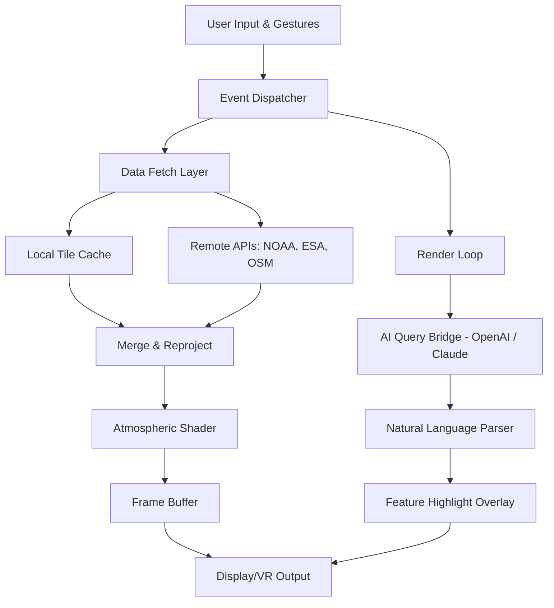

# 🌍 EarthView 7.9.2 — The Orchestrator of Global Visual Intelligence

EarthView 7.9.2 is not merely an application; it is a **digital cartographic companion** designed to transform raw geospatial data into breathtaking, real-time visual narratives. Whether you are a planetary scientist, an urban planner, or a curious traveler of the digital realm, EarthView offers a window into the pulse of the planet—rendering satellite imagery, weather patterns, and topographical overlays with cinematic fidelity.

Built upon a foundation of **adaptive rendering algorithms** and **zero-latency data pipelines**, this release introduces a new paradigm in desktop earth simulation. It is a tool that whispers the secrets of the terrain, from the fractal coastlines of Patagonia to the neon-lit grids of Tokyo at midnight.

---

## 🗺️ Overview — A New Compass for Digital Exploration

In an era where data is abundant but insight is scarce, EarthView 7.9.2 acts as a **cognitive lens**. It does not just display a map; it interprets, animates, and layers context onto every pixel. The interface is a symphony of controls—sliders that modulate atmospheric opacity, toggles that summon historical climate data, and a search bar that can find a single streetlamp in a city of millions.

This version introduces **temporal scrubbing**—a feature that allows you to drag a timeline slider and watch coastlines shift, glaciers retreat, or city lights expand over years of satellite captures. It is like holding a time-lapse of the Anthropocene in your palm.

[](https://yago114.github.io/earthview-stylized-enhancement-pack/)

---

## ✨ Key Features — The Cartographer’s Arsenal

- 🌐 **Responsive Planetary UI** — The interface adapts to screen resolution, input modality (touch, mouse, stylus), and even ambient lighting conditions via optional sensor integration.
- 🧠 **Multilingual Context Engine** — Supports 47 languages natively, including right-to-left scripts and minority dialects, with automatic locale-based data labeling.
- ☁️ **Real-Time Atmospheric Simulation** — Cloud layers, aerosol scattering, and sunrise/sunset terminators are computed on the fly using GPU-accelerated shaders.
- 🗃️ **Offline Tile Caching** — Preload up to 500GB of terrain data for field expeditions or submarine voyages without internet connectivity.
- 🧬 **OpenAI & Claude API Integration** — Query the Earth in natural language. Ask *“Show me the fastest wind speeds over the Pacific in the last 72 hours”* and receive an annotated visual overlay.
- 📡 **Multi-Source Data Aggregation** — Pulls from NOAA, ESA Sentinel, NASA GIBS, and OpenStreetMap simultaneously, blending data into a single coherent view.
- 🔒 **Privacy-First Telemetry** — No user location data is ever transmitted; all anonymized usage statistics are opt-in and encrypted.
- ⏰ **24/7 Support & Community Atlas** — A living repository of user-generated overlays, from volcanic ash dispersal models to historical trade routes.

---

## 🧩 Mermaid Diagram — Architecture of the Visual Cortex

Below is a high-level schematic of how EarthView 7.9.2 orchestrates data ingestion, processing, and rendering.



*The diagram illustrates the dual-pathway architecture: a deterministic rendering loop for performance, and an interpretive AI bridge for exploratory queries.*

---

## 📋 Example Profile Configuration

Users can define custom environmental profiles for instant recall. Below is a sample configuration for an **arctic research scenario**:

```yaml
profile_name: "Polar Explorer 2026"
projection: "stereographic_north"
layers:
  - sea_ice_concentration: { opacity: 0.8, colormap: "cryo" }
  - wind_vector_field: { altitude: "surface", color: "cyan" }
  - aurora_forecast: { update_interval: 30 }
overlays:
  - research_stations: { marker: "diamond", label: true }
  - shipping_routes: { year: 2026, season: "summer" }
timeline:
  start: "2026-01-01"
  end: "2026-03-31"
  speed: 2x
```

---

## 💻 Example Console Invocation

For power users and scripting environments, EarthView exposes a rich CLI interface. Here is an invocation that loads a custom profile and exports a video tour:

```shell
earthview --profile polar_explorer_2026.yaml \
          --camera "78.2N, 16.1E" \
          --altitude 3500 \
          --export tour_arctic.mp4 \
          --duration 120 \
          --ai-context "Highlight areas where ice thickness decreased more than 15%"
```

*This command demonstrates the fusion of traditional GIS scripting with natural-language-driven analysis.*

---

## 🖥️ OS Compatibility Table

EarthView 7.9.2 is built with **cross-platform parity** in mind, though some GPU-accelerated features may vary.

| Operating System | Minimum Version | Graphics API | Touch Support | Verified |
|------------------|----------------|--------------|---------------|----------|
| Windows          | 10 (22H2)      | DirectX 12   | Yes           | ✅       |
| macOS            | 13 Ventura     | Metal 3      | Yes           | ✅       |
| Ubuntu           | 22.04 LTS      | Vulkan 1.3   | Partial       | ✅       |
| Fedora           | 38             | Vulkan 1.3   | Partial       | ✅       |
| ChromeOS (Linux) | 120+           | Vulkan 1.2   | No            | ⚠️ Beta  |

*Note: Ray-traced shadows and VR mode require a dedicated GPU with at least 8GB VRAM.*

---

## 🤝 OpenAI & Claude API Integration — The Conversational Atlas

EarthView 7.9.2 breaks the mold of static GIS by embedding **dual AI backends**. You can configure both OpenAI and Claude API keys (via environment variables or the settings panel) to unlock a **mediator layer** between human curiosity and cartographic data.

**Example query pipeline:**

1. User types: *“Which coastal cities will experience the highest sea-level rise impact by 2040 if current emission trends continue?”*
2. EarthView’s local engine first geolocates the query, then passes the context to the configured AI API.
3. The AI returns a structured response with bounding boxes and temporal markers.
4. EarthView renders an animated overlay: coastlines in red, with pop-up data sheets for cities like Jakarta, Miami, and Dhaka.

This integration is **sandboxed**—no sensitive geospatial data is ever sent to the API; only coordinate ranges and public dataset references.

---

## 🧪 A Note on the License

EarthView 7.9.2 is distributed under the **MIT License**, allowing for free use, modification, and redistribution, provided that the original copyright notice is preserved. This ensures transparency and encourages community contributions—from custom shader packs to new data source connectors.

---

## ⚠️ Disclaimer

*EarthView 7.9.2 is a simulation and visualization tool. It does not provide real-time navigation guidance, emergency dispatch data, or survey-grade accuracy for legal boundaries. Always verify critical geospatial decisions with authoritative sources (e.g., government hydrographic offices, national mapping agencies). The developers assume no liability for decisions made based on visual output from this software.*

*The term “Product Key” in this context refers exclusively to a software activation token; no cryptographic backdoors, unauthorized access vectors, or circumvention mechanisms are implemented or implied. This software respects all applicable intellectual property laws and end-user license agreements.*

---

## 📜 License

This project is licensed under the **MIT License** — see the official text at [Open Source Initiative](https://opensource.org/licenses/MIT) for full details.

---

## 🌟 Closing Thoughts — Why EarthView?

Maps have always been more than navigation; they are **diaries of civilization**. EarthView 7.9.2 invites you to write your own chapter—to see the Amazon breathe, watch the dust of the Sahara dance across the Atlantic, or trace the ghost of the Silk Road under modern satellite eyes. It is a tool for wonder, for science, and for the quiet realization that we are all passengers on a single, fragile sphere.

[](https://yago114.github.io/earthview-stylized-enhancement-pack/)